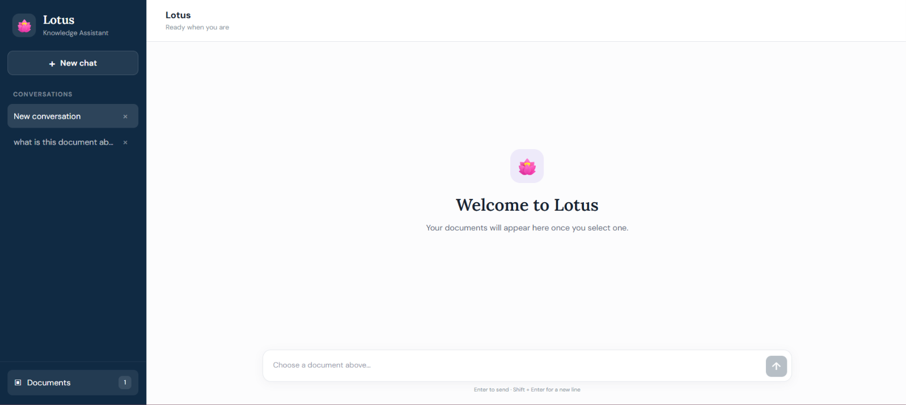
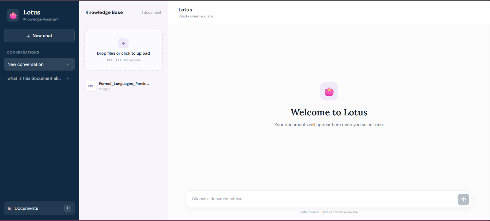
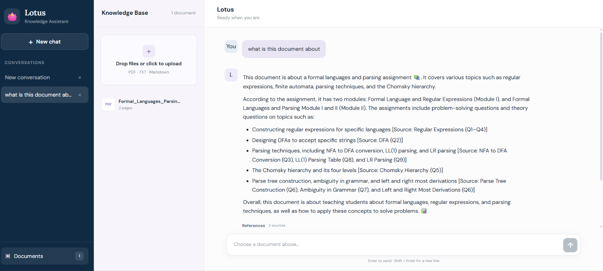

# 🪷 Lotus — Local RAG Knowledge Assistant

Lotus is a local RAG-based assistant for chatting with your documents.

Upload a PDF, TXT, or Markdown file, select it, and ask questions about its content. The project uses ChromaDB for document retrieval and Llama 3.2 through Ollama to generate answers locally.

## Setup

### 1. Clone the repository

```bash
git clone https://github.com/umasri2006/rag-assistant.git
cd rag-assistant
```
### 2. Start Ollama

Install Ollama, then download the model:

```bash
ollama pull llama3.2
```
### 3. Run the backend

Open a terminal:

```powershell
cd backend
python -m venv venv
.\venv\Scripts\Activate.ps1
pip install -r requirements.txt
python main.py
```

Backend: `http://127.0.0.1:8000`    

API Docs: `http://127.0.0.1:8000/docs`

### 4. Run the frontend

Open another terminal:

```powershell
cd frontend
npm install
npm run dev
```
Frontend: `http://localhost:5173`

## Tech Stack

**Frontend:** React, TypeScript, Vite, CSS  
**Backend:** Python, FastAPI, LangChain  
**AI:** Llama 3.2, Ollama, Hugging Face Embeddings  
**Database:** ChromaDB

## Project Structure
```text
rag-assistant/
├── backend/
│   ├── core/
│   ├── models/
│   ├── routers/
│   ├── main.py
│   └── requirements.txt
│
├── frontend/
│   ├── src/
│   ├── package.json
│   └── vite.config.ts
│
├── docs/
│   └── screenshots/
│
├── README.md
└── .gitignore
```
## Preview
### 1. Document Selection



### 2. Chat Interface



### 3. Document-Based Answer

